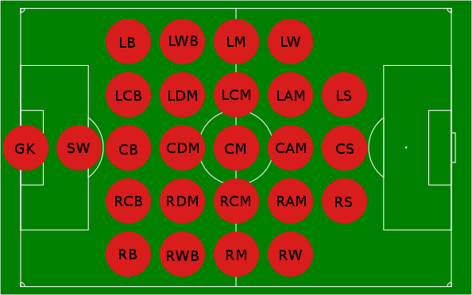

# Pasala Game

This game is for passing the ball between players. You can win counting the number of passes or by scoring a goal.

## Campo de juego

Esta divido en una grilla de 10 de ancho 20 de altura.

## playing positions that can be used by a team are:

* GK – Goalkeeper.
* SW – Sweeper.
* CB (CB / LCB / RCB) – Centre Back (Central Centre Back / Left (off-centre) Centre Back / Right (off-centre) Centre Back). Also known as Centre Half (Central Centre Half / Left (off-centre) Centre Half / Right (off-centre) Centre Half).
* FB (LB / RB) – Full Back (Left Back / Right Back).
* WB (LWB / RWB) – Wing Back (Left Wing Back / Right Wing Back).
DM (CDM / LDM / RDM) – Defensive Midfielder (Central Defensive Midfielder / Left (off-centre) Defensive Midfielder / Right (off-centre) Defensive Midfielder).
* CM (CM / LCM / RCM) – Centre Midfielder (Central Centre Midfielder / Left (off-centre) Centre Midfielder / Right (off-centre) Centre Midfielder).
* WM (LM / RM) – Wing Midfielder (Left Midfielder / Right Midfielder).
* AM (CAM / LAM / RAM) – Attacking Midfielder (Central Attacking Midfielder / Left (off-centre) Attacking Midfielder / Right (off-centre) Attacking Midfielder). The off-centre playing positions are also known as Inside Forward (Inside Left / Inside Right).
* WF (LWF / RWF) – Wing Forward (Left Wing Forward / Right Wing Forward). Also known as Outside Forward (Outside Left / Outside Right).
* CF (CF / LCF / RCF) – Centre Forward (Central Centre Forward / Left (off-centre) Centre Forward / Right (off-centre) Centre Forward). Also known as Striker (Central Striker / Left (off-centre) Striker / Right (off-centre) Striker).

